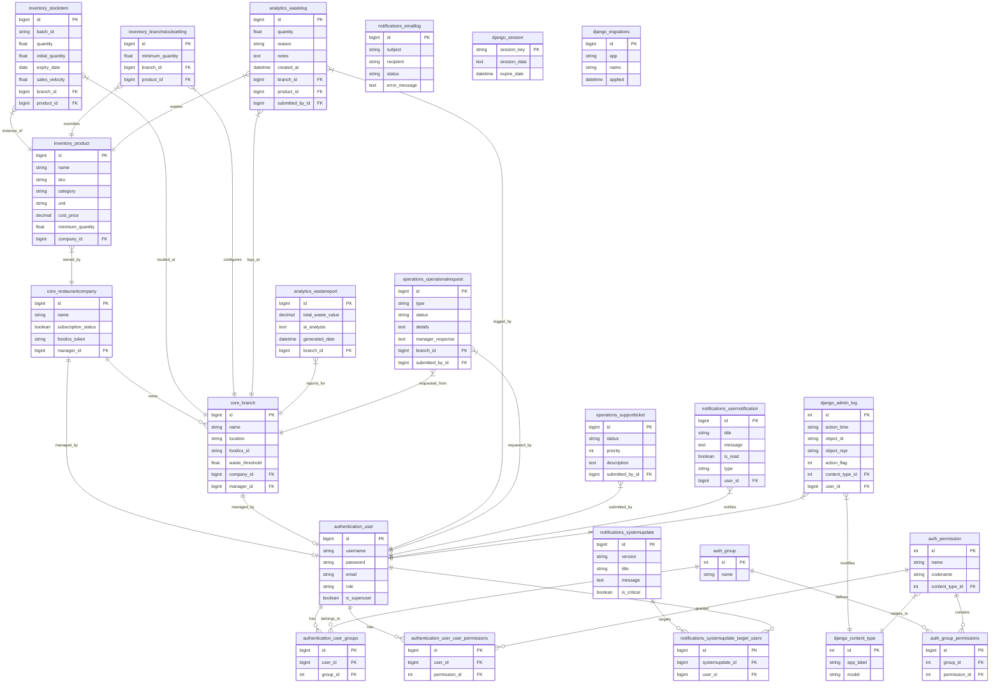

# Zero Waste Project - Full Database Schema (ERD)

Copy the code block below and paste it into [Mermaid Live Editor](https://mermaid.live/) or diagrams.net (draw.io) to generate the diagram.

```mermaid
erDiagram
    %% --- AUTHENTICATION & USERS ---
    authentication_user {
        bigint id PK
        string username
        string password
        string email
        string role
        boolean is_superuser
    }
    auth_group {
        int id PK
        string name
    }
    auth_permission {
        int id PK
        string name
        string codename
        int content_type_id FK
    }
    authentication_user_groups {
        bigint id PK
        bigint user_id FK
        int group_id FK
    }
    authentication_user_user_permissions {
        bigint id PK
        bigint user_id FK
        int permission_id FK
    }
    auth_group_permissions {
        bigint id PK
        int group_id FK
        int permission_id FK
    }

    %% --- CORE APP ---
    core_restaurantcompany {
        bigint id PK
        string name
        boolean subscription_status
        string foodics_token
        bigint manager_id FK
    }
    core_branch {
        bigint id PK
        string name
        string location
        string foodics_id
        float waste_threshold
        bigint company_id FK
        bigint manager_id FK
    }

    %% --- INVENTORY APP ---
    inventory_product {
        bigint id PK
        string name
        string sku
        string category
        string unit
        decimal cost_price
        float minimum_quantity
        bigint company_id FK
    }
    inventory_stockitem {
        bigint id PK
        string batch_id
        float quantity
        float initial_quantity
        date expiry_date
        float sales_velocity
        bigint branch_id FK
        bigint product_id FK
    }
    inventory_branchstocksetting {
        bigint id PK
        float minimum_quantity
        bigint branch_id FK
        bigint product_id FK
    }

    %% --- ANALYTICS APP ---
    analytics_wastelog {
        bigint id PK
        float quantity
        string reason
        text notes
        datetime created_at
        bigint branch_id FK
        bigint product_id FK
        bigint submitted_by_id FK
    }
    analytics_wastereport {
        bigint id PK
        decimal total_waste_value
        text ai_analysis
        datetime generated_date
        bigint branch_id FK
    }

    %% --- OPERATIONS APP ---
    operations_operationalrequest {
        bigint id PK
        string type
        string status
        text details
        text manager_response
        bigint branch_id FK
        bigint submitted_by_id FK
    }
    operations_supportticket {
        bigint id PK
        string status
        int priority
        text description
        bigint submitted_by_id FK
    }

    %% --- NOTIFICATIONS APP ---
    notifications_usernotification {
        bigint id PK
        string title
        text message
        boolean is_read
        string type
        bigint user_id FK
    }
    notifications_systemupdate {
        bigint id PK
        string version
        string title
        text message
        boolean is_critical
    }
    notifications_systemupdate_target_users {
        bigint id PK
        bigint systemupdate_id FK
        bigint user_id FK
    }
    notifications_emaillog {
        bigint id PK
        string subject
        string recipient
        string status
        text error_message
    }

    %% --- DJANGO SYSTEM TABLES ---
    django_session {
        string session_key PK
        text session_data
        datetime expire_date
    }
    django_migrations {
        bigint id PK
        string app
        string name
        datetime applied
    }
    django_content_type {
        int id PK
        string app_label
        string model
    }
    django_admin_log {
        int id PK
        string action_time
        string object_id
        string object_repr
        int action_flag
        int content_type_id FK
        bigint user_id FK
    }

    %% --- RELATIONSHIPS ---
    authentication_user ||--o{ authentication_user_groups : has
    auth_group ||--o{ authentication_user_groups : belongs_to
    authentication_user ||--o{ authentication_user_user_permissions : has
    auth_permission ||--o{ authentication_user_user_permissions : granted
    auth_group ||--o{ auth_group_permissions : defines
    auth_permission ||--o{ auth_group_permissions : contains

    core_restaurantcompany ||--o{ core_branch : owns
    core_restaurantcompany ||--o| authentication_user : managed_by
    core_branch ||--o| authentication_user : managed_by

    inventory_product }|--|| core_restaurantcompany : owned_by
    inventory_stockitem }|--|| core_branch : located_at
    inventory_stockitem }|--|| inventory_product : instance_of
    inventory_branchstocksetting }|--|| core_branch : configures
    inventory_branchstocksetting }|--|| inventory_product : overrides

    analytics_wastelog }|--|| core_branch : logs_at
    analytics_wastelog }|--|| inventory_product : wastes
    analytics_wastelog }|--|| authentication_user : logged_by
    analytics_wastereport }|--|| core_branch : reports_for

    operations_operationalrequest }|--|| core_branch : requested_from
    operations_operationalrequest }|--|| authentication_user : requested_by
    operations_supportticket }|--|| authentication_user : submitted_by

    notifications_usernotification }|--|| authentication_user : notifies
    notifications_systemupdate ||--o{ notifications_systemupdate_target_users : targets
    authentication_user ||--o{ notifications_systemupdate_target_users : receives

    django_admin_log }|--|| authentication_user : performed_by
    django_admin_log }|--|| django_content_type : modifies
    auth_permission }|--|| django_content_type : relates_to
```
