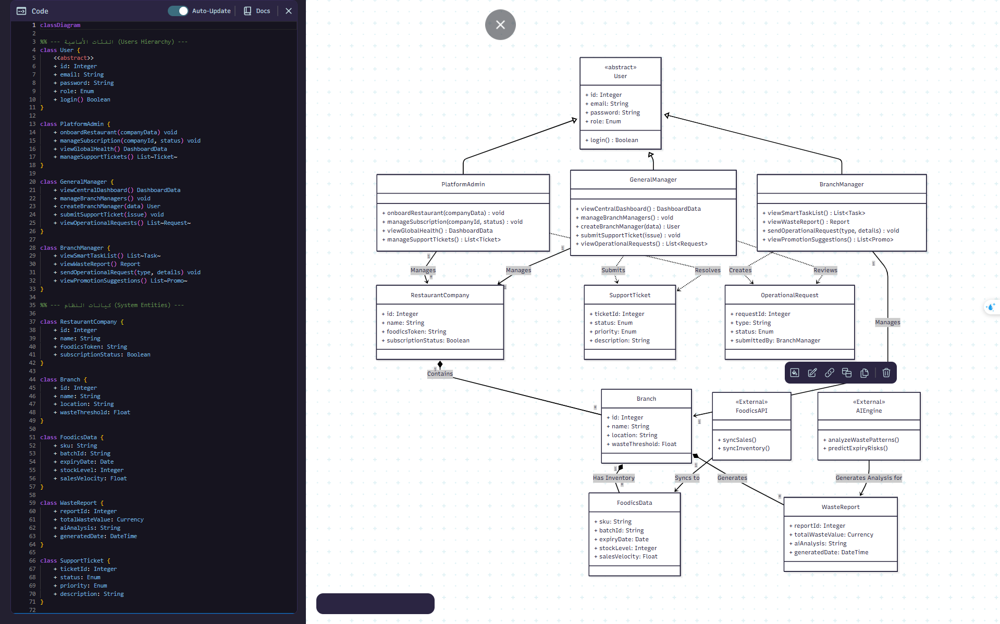

# Zero-Waste

# 📦 Ni’mah Project - User Stories

This document outlines the user stories for the **Ni’mah** platform, a SaaS solution for restaurant inventory and waste management integrated with Foodics.

The system relies on **automation and AI** to pull data from Foodics (Sales & Inventory), eliminating the need for manual data entry by low-level staff.

## 👥 User Roles (الأدوار)

### 🏢 Client Side (المطاعم المشتركة)
1.  **General Manager (Company Admin):** The owner or high-level manager overseeing all branches. Focuses on financials and strategic oversight.
2.  **Branch Manager:** Responsible for a single location. Focuses on daily operations and waste reduction actions.

### 🛠️ Platform Side (إدارة نظام نعمة)
3.  **Platform Admin:** Manages restaurant onboarding, subscriptions, and system settings.
4.  **Support & Maintenance:** Handles technical issues and API connectivity monitoring.

### 🤖 System & Intelligence
5.  **System & AI:** The automated engine that syncs data and generates insights.

---

## 1. Restaurant Management (Client Side) | إدارة المطعم

### 👤 General Manager (Company Admin)
| ID | As a... | I want to... | So that... |
| :--- | :--- | :--- | :--- |
| **GM-01** | General Manager | View a **centralized dashboard** aggregating waste data from all branches. | I can identify high-waste locations and monitor overall financial loss. |
| **GM-02** | General Manager | Receive **automated alerts** when a branch exceeds a specific waste threshold. | I can intervene immediately to hold the branch management accountable. |
| **GM-03** | General Manager | Compare **Theoretical Inventory** (Foodics) vs. **Actual Waste** reported. | I can detect discrepancies that might indicate theft or unreported waste. |
| **GM-04** | General Manager | Create and manage **Branch Manager accounts** and assign them to specific locations. | I ensure each manager only accesses the data relevant to their branch. |
| **GM-05** | General Manager | Submit and track **Technical Support Tickets** directly from the dashboard. | I can get quick help if the system or data sync fails. |

### 👤 Branch Manager
| ID | As a... | I want to... | So that... |
| :--- | :--- | :--- | :--- |
| **BM-01** | Branch Manager | Have the system **auto-fetch expiry dates** and inventory batches from Foodics. | I don't waste time manually entering dates or relying on staff data entry. |
| **BM-02** | Branch Manager | Receive a daily **"Smart Task List"** of items nearing expiry. | I can direct the kitchen staff to use these items first (FIFO) to prevent waste. |
| **BM-03** | Branch Manager | View a breakdown of the **"Top Wasted Items"** in my branch with AI-analyzed reasons. | I can adjust my purchasing orders for the next week based on facts. |
| **BM-04** | Branch Manager | Receive **promotion suggestions** for items at risk of expiring. | I can convert potential waste into sales (e.g., "50% off on Salad"). |
| **BM-05** | Branch Manager | Send **operational requests** (e.g., extra supplies check) to the General Manager. | I can communicate branch needs formally within the platform. |

---

## 2. Platform Administration (SaaS Team) | إدارة المنصة

### 🛡️ Platform Admin
| ID | As a... | I want to... | So that... |
| :--- | :--- | :--- | :--- |
| **PA-01** | Platform Admin | Onboard a **new Restaurant (Company)** and link their Foodics account. | New clients can access the system and start syncing their data. |
| **PA-02** | Platform Admin | Manage **subscriptions and billing status** (Active/Inactive). | I can restrict access for companies with expired subscriptions. |
| **PA-03** | Platform Admin | View a **Global Health Dashboard** for all clients. | I can monitor system performance and active users across the platform. |
| **PA-04** | Platform Admin | View and filter **Support Tickets** submitted by clients. | I can oversee the support quality and intervene in critical issues. |

### 🔧 Support & Maintenance
| ID | As a... | I want to... | So that... |
| :--- | :--- | :--- | :--- |
| **SM-01** | Support Staff | Monitor the **API Sync Status** with Foodics for each client. | I can proactively fix connection errors before the client notices missing data. |
| **SM-02** | Support Staff | View and manage **Support Tickets** submitted by restaurant managers. | I can track and resolve user issues efficiently. |

---

## 3. System Automation & AI | الأتمتة والذكاء الاصطناعي

### 🤖 The System
| ID | As a... | I want to... | So that... |
| :--- | :--- | :--- | :--- |
| **SYS-01** | System (Integrator) | **Sync data in real-time** (Sales & Inventory) from Foodics API. | The dashboard always reflects the current reality without manual input. |
| **SYS-02** | System (AI Detector) | Detect **data anomalies** (e.g., high consumption of an ingredient with low sales). | I can flag potential operational errors or theft to the manager. |
| **SYS-03** | System (Predictor) | **Forecast waste levels** for the upcoming week based on historical trends. | Managers can make informed decisions about pausing stock orders. |

Class daigram : 

